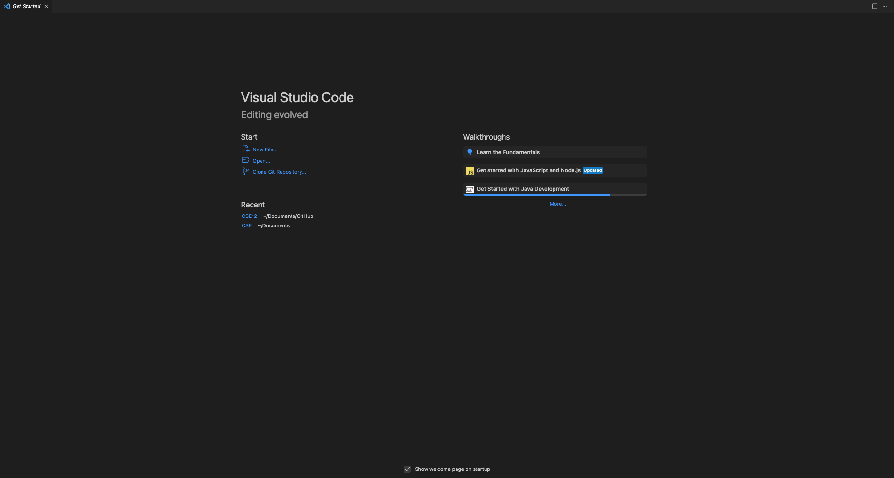

# CSE 15L Lab Report 
*Akash Premkumar*
*PID: A16822598*
---
## Lab Report 1
---
Objective: write a tutorial for incoming 15L students (and your future self!) about how to log into a course-specific account on ieng6. 

**Step 1: Installing Visual Studio Code**

Depending on the systems that you have access to, it is important to make sure that you are able to install VS Code for this tutorial. 

As a result, the first step under this major step is to go to this [Link]((https://code.visualstudio.com/download))

Once you have completed this step depending on the operating/computer system that you have, for the sake of the tutorial I will be explaining it in terms of a windows system and mac system when it differs or if necessary. 
 
*Once VS Code is up and running, it should appear like the image below:*


Now that VS Code is installed, it is important to also make sure that if you are using a UCSD Desktop to have your password reset on this [Link](https://sdacs.ucsd.edu/~icc/index.php)

More about this can be found here at this link: [Link](https://docs.google.com/document/d/1hs7CyQeh-MdUfM9uv99i8tqfneos6Y8bDU0uhn1wqho/edit)


**Step 2: Install Git**

Git is a free/open source distrubuted version control system. It is important to install this as well along side VS Code. Go to this [Link](https://git-scm.com/) and the instructions are quite simple as it is just installing based on the operating system chosen. 

**Step 3: Install Bash in VS Code**

Within Visual Studio, it is important to open a terminal by 

1. holding down Ctrl + '. 
2. After that step, we can open the command pallete using Ctrl + Shift + P. 
3. After that, go to "Select Default Profile" and then select "bash". 
4. Originally it should be on powershell. 

**Step 4: Let's Begin Remote Connecting**

So an important concept to keep in mind is SSH which stands for Secure Shell. So in our case, we must first open a terminal within VS Code. Since we are UCSD students, this will be oriented toward this audience. 

1. Open terminal in VS Code
2. Type 
```
ssh cs15lwi23zz@ieng6.ucsd.edu

```
3. Now, the "zz" within is for you to include a three digit letter code that will be found in your UCSD Account Password Reset we did above. In my case, it was ahg so my ssh would look like 
```
ssh cs15lwi23ahg@ieng6.ucsd.edu

```
4. If done correctly, this should show a message 

```
The authenticity of host 'ieng6.ucsd.edu (128.54.70.227)' can't be established.
RSA key fingerprint is SHA256:ksruYwhnYH+sySHnHAtLUHngrPEyZTDl/1x99wUQcec.
Are you sure you want to continue connecting (yes/no/[fingerprint])? 

```

5. Say Yes

6. You will then need to type a password and beware that when passwords are typed in a terminal, it will feel like nothing is being typed but it is being typed

7. If this is successful, another similar message of words should be on your screen 

```
# Now on remote server
Last login: Sun Jan  2 14:03:05 2022 from 107-217-10-235.lightspeed.sndgca.sbcglobal.net
quota: No filesystem specified.
Hello cs15lwi23zz, you are currently logged into ieng6-203.ucsd.edu

You are using 0% CPU on this system

Cluster Status 
Hostname     Time    #Users  Load  Averages  
ieng6-201   23:25:01   0  0.08,  0.17,  0.11
ieng6-202   23:25:01   1  0.09,  0.15,  0.11
ieng6-203   23:25:01   1  0.08,  0.15,  0.11

Sun Jan 02, 2022 11:28pm - Prepping cs15lwi23

```
**Step 5: It is time to test out some commands while being in remote connecting**

Now there are multiple commands and the ones I used while I was in lab are listed below
1. cd ~
2. cd
3. ls -lat
4. ls -a
5. ls <directory> where <directory> is /home/linux/ieng6/cs15lwi23/cs15lwi23abc, where the abc is one of the other group members’ username
6. cp /home/linux/ieng6/cs15lwi23/public/hello.txt ~/
7. cat /home/linux/ieng6/cs15lwi23/public/hello.txt
8. ls
9. pwd
10. mkdir
11. cp
 
So you might be wondering, what do I do. The answer is simple which is basically type out or just copy/paste the commands listed above and see what happens. 
 
 Now I will caution, there will be images below that I took when I was first trying out remote connecting and the results were defintely interesting. 
 
 Now before I deep dive and explain everything, lets try out the commands first(each command will be accompanied by an image)

1. cd ~
 
 
2. cd
 
 
3. ls -lat
 
 
4. ls -a
 
 
5. ls <directory> where <directory> is /home/linux/ieng6/cs15lwi23/cs15lwi23abc, where the abc is one of the other group members’ username
 
 
6. cp /home/linux/ieng6/cs15lwi23/public/hello.txt ~/
 
 
7. cat /home/linux/ieng6/cs15lwi23/public/hello.txt
 
 
