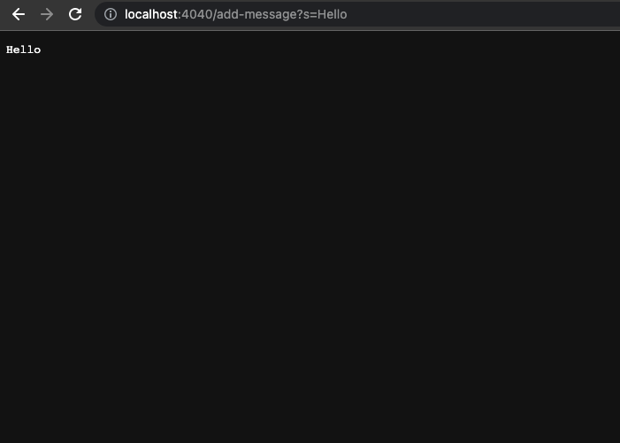
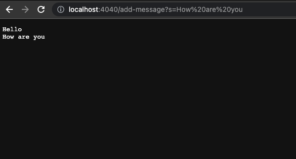
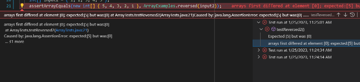

# CSE 15L Lab Report  
*Akash Premkumar*
*PID: A16822598*
---
## Lab Report 2: Servers and Bugs 
---
Objective: Write code for a web server
---
**Part 1**
---
So I want to say up front that there will be usage of files from the wavelet github files before I get into the steps of the assignment. More specifically, the Server.java file. This file configures an HTTP server using Java's built-in HttpServer. A class called "Server" is created by the program, which begins an HTTP server on the specified port and has a single endpoint, "/," which is handled by a class called "ServerHttpHandler."


Back to the assignment though, the main goal in Part 1 is to Write a web server called StringServer that supports the path and behavior as described in the lab write up. 

---
In Step 1, I want to first show the code that I ended up making for my `StringServer`. I want to explain my code to make sure that as future readers, you will be able to understand the components that make up my code as you see my code. 

Here is my code for the StringServer.java file:
```
import java.io.IOException;
import java.net.URI;

class Handler implements URLHandler {
    // The one bit of state on the server: a number that will be manipulated by
    // various requests.
    String message = "";

public String handleRequest(URI url) {
    if (url.getPath().contains("/add-message"))  {
        String[] parameters = url.getQuery().split("=");
        if (parameters[0].equals("s")) 
        {
            message += parameters[1] + "\n";
            return message;
        } 
    } 
        return "404 Not Found!";
    }
}


class StringServer {
    public static void main(String[] args) throws IOException {
        if(args.length == 0){
            System.out.println("Missing port number! Try any number between 1024 to 49151");
            return;
        }

        int port = Integer.parseInt(args[0]);

        Server.start(port, new Handler());
    }
}

```

Here is my code and if it looks confusing, here is a little breakdown to clear anything up. 

This code first creates a straightforward string server utilizing the HTTP server established in the preceding code. The "Handler" class defines the "handleRequest" method and implements the "URLHandler" interface. This method determines whether the incoming URI's route contains the phrase "/add-message," and if it does, it separates the query portion of the URI into pairs and, if the key is "s," adds the value to a "message" string. It then gives back the revised "message" string. The method returns a "404 Not Found!" error message if the path does not contain "/add-message."

The "StringServer" class takes the first command line argument as the port number, starts the server and passes in a new instance of the "Handler" class as the URL handler. If the port number is not provided as a command line argument, it prints a message to provide one.

As stated in the next step of the lab, here are two screenshots of using `/add-message`, 

Here is the first screenshot:



In this case, a URL that specifies an HTTP request to a server running on the local machine (localhost) at port 4040. The request is sent to the endpoint "/add-message" and contains a query string "s=Hello". When this request is received by the server, the "handleRequest" method in the "Handler" class will be called with the given URI. The method will parse the query string and add "Hello" to the "message" string. The updated "message" string will then be returned as the response to the HTTP request.

Here is the second screenshot:



Now for Part 1, I have to answer these questions for each screenshot.

1. Which methods in your code are called?
2. What are the relevant arguments to those methods, and the values of any relevant fields of the class?
3. How do the values of any relevant fields of the class change from this specific request? If no values got changed, explain why.

*For the first screenshot: When `Hello` is passed to `handleRequest'* 

1. In the code block above, The `main` method and the `handleRequest` method are called.
2. Since the parameter is a string, it can take any `int`, `String`, and `URI`. 
3. In this case, no values change as specific requests because looking at the value, it takes a string parameter. The value of message is updated by concatenating the value of the parameter in the query string with a newline character.


For the second screenshot: When `How are you` is passed to `handleRequest`*

1. In the code block above, The `main` method and the `handleRequest` method are called.
2. Since the parameter is a string, it can take any `int`, `String`, and `URI`. The main method is called with the first argument as the port number. 
3. In this case, the values change because looking at the value, it takes a string parameter. The value of message is updated by concatenating the value of the parameter in the query string with a newline character. This new request is written beneath the previous one. 

---

**Part 2**

Here is part 2:
---

For my Part 2, I will be specifically lookijng at the issues that were in `ArrayExamples.java`. 

But first this is the code from the `ArrayExamples.java` file:
```


public class ArrayExamples {

  // Changes the input array to be in reversed order
  static void reverseInPlace(int[] arr) {
    for(int i = 0; i < arr.length; i += 1) {
      arr[i] = arr[arr.length - i - 1];
    }
  }

  // Returns a *new* array with all the elements of the input array in reversed
  // order
  static int[] reversed(int[] arr) {
    int[] newArray = new int[arr.length];
    for(int i = 0; i < arr.length; i += 1) {
      arr[i] = newArray[arr.length - i - 1];
    }
    return arr;
  }

  // Averages the numbers in the array (takes the mean), but leaves out the
  // lowest number when calculating. Returns 0 if there are no elements or just
  // 1 element in the array
  static double averageWithoutLowest(double[] arr) {
    if(arr.length < 2) { return 0.0; }
    double lowest = arr[0];
    for(double num: arr) {
      if(num < lowest) { lowest = num; }
    }
    double sum = 0;
    for(double num: arr) {
      if(num != lowest) { sum += num; }
    }
    return sum / (arr.length - 1);
  }


}


```

Here is the `ArrayTests.java` file:

```
import static org.junit.Assert.*;
import org.junit.*;

public class ArrayTests {
	@Test 
	public void testReverseInPlace() {
    int[] input1 = { 3 };
    ArrayExamples.reverseInPlace(input1);
    assertArrayEquals(new int[]{ 3 }, input1);
	}


  @Test
  public void testReversed() {
    int[] input1 = { };
    assertArrayEquals(new int[]{ }, ArrayExamples.reversed(input1));
  }
}


```
All the code above is just the original files. 


Provide:
1.  A failure-inducing input for the buggy program, as a JUnit test and any associated code (write it as a code block in Markdown)

Here is a failure inducing input. 

```
@Test
  public void testReversed() {
    int[] input2 = { 1, 2, 3, 4, 5 };
    assertArrayEquals(new int[] { 5, 4, 3, 2, 1 }, ArrayExamples.reversed(input2));
  }

```

2. An input that doesn’t induce a failure, as a JUnit test and any associated code (write it as a code block in Markdown)
```


```

3.  The symptom, as the output of running the tests 



It has been noted that the actual output's first array element differs from what was anticipated. It should be 5, but it is only 0.

4.  The bug, as the before-and-after code change required to fix it (as two code blocks in Markdown)

Before: 
```
static int[] reversed(int[] arr) {
    int[] newArray = new int[arr.length];
    for(int i = 0; i < arr.length; i += 1) {
      arr[i] = newArray[arr.length - i - 1];
    }
    return arr;
  }

```
After:
```
static int[] reversed(int[] arr) {
   int[] newArray = new int[arr.length];


   for (int i = 0; i < arr.length; i += 1) {
     newArray[i] = arr[arr.length - i - 1];
   }
   return newArray;
 }
#Wrong array was being returned originally

```
Briefly describe why the fix addresses the issue:

Instead of saving the reversed elements in a new array called newArray, the original code inverted the elements in the same array arr. The corrected code successfully stores the elements in newArray in the reversed order before returning it. This resolves the issue of returning the original input array rather than one that has been reversed.

---
**Part 3**

In the lab for week 2, I definetely learned some interesting lessons and material that relates to this lab. For instance in week 2, I learned extensively about Github Desktop and what it serves. I was curious as to why the interface was so simple and limited but I understood its purpose as I went through the lab which is that it mainly serves as a application to track changes. I also never knew how to run a server so being able to see the Server.java file and NumberServer.java file, I learned that when we can use any number to represent a port number and the run statement would look like `java NumberServer 4000`. 

**End of Lab**
